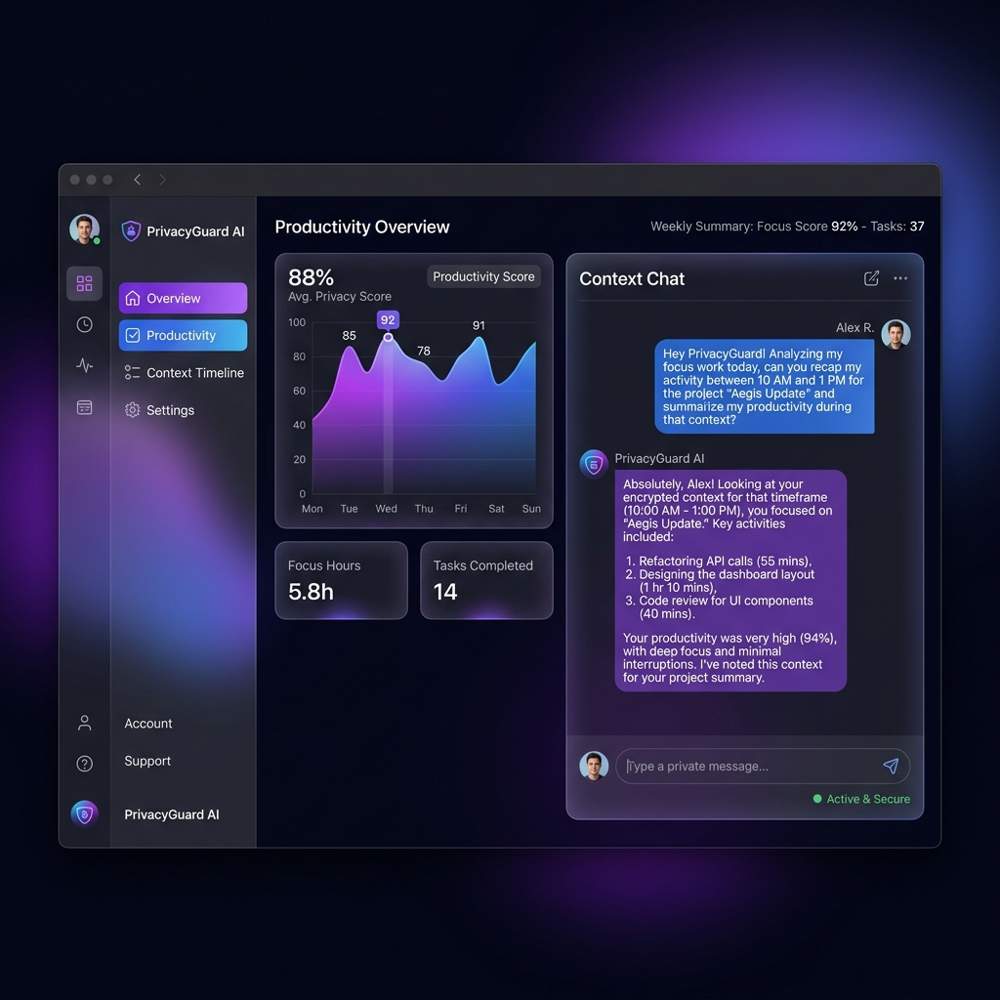

# Aura Context Assistant


Aura Context is a local, privacy-first, and intelligent desktop assistant for macOS. It gracefully runs in the background, capturing your active windows, tracking your productivity, and monitoring clipboard content. Using the power of local LLMs (via Ollama), it serves as a continuously-aware AI companion that can answer questions about anything you've seen or done recently on your computer.

All context data is saved purely locally in a SQLite database, ensuring your privacy completely remains yours. No cloud uploads, no external APIs.

## 🚀 Download for macOS

You can download the latest installer for macOS (Apple Silicon and Intel) from the releases page:

- [⬇️ Download Aura Context (.dmg) for macOS](https://github.com/maheshsd/context-assistant/releases/latest)

> **Note:** Because the application is not signed with an Apple Developer Account, macOS Gatekeeper may show an "unidentified developer" warning. To safely open it, locate the app in Finder, right-click, and select **Open**.

## ✨ Key Features

- 🧠 **Local AI Chat:** Securely converse with a local AI (powered by Ollama) that has historical context of your activity, effectively functioning as a "second brain".
- 🗂️ **Productivity Intelligence:** Automatically categorizes all application/website activity into 10 contextual categories (Development, Communication, Research, etc.) to give you a productivity score.
- 🕰️ **Context Timeline:** A rich, searchable timeline of your digital day, neatly organized with timestamps and app metadata.
- 📊 **Insightful Dashboard:** Clear, elegant visual data representations outlining the time you've spent across different applications and categories.
- 🔒 **100% Privacy Focused:** Everything runs locally. Your keyboard activity and context data never leave your machine.
- 🎨 **Premium UI:** Gorgeous dark-mode themed user interface with glassmorphism, fluid animations, and a seamless developer experience.

## 🛠️ Technology Stack

- **Frontend:** React, TypeScript, Vite
- **Desktop Environment:** Electron
- **Database Engine:** Local SQLite (`better-sqlite3`)
- **AI Inference Engine:** Ollama (requires local installation)

## 💻 Local Development

If you'd like to build and run the application from its source code:

1. Clone the repository:
   ```bash
   git clone https://github.com/maheshsd/context-assistant.git
   cd context-assistant
   ```

2. Install the necessary dependencies:
   ```bash
   npm install
   ```

3. Ensure Ollama is running locally and has the required target model pulled (e.g., `llama3`):
   ```bash
   ollama pull llama3
   ```

4. Start the Vite development frontend and the Electron application concurrently:
   ```bash
   npm run dev
   ```

5. To bundle the app for production (creating the macOS `.dmg` and `.app` bundle):
   ```bash
   npm run build
   ```

## 📝 License

This project is licensed under the MIT License.
